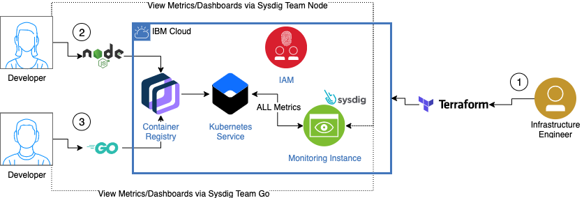

# IBM Cloud Monitoring with Sysdig Teams

Use this template to:
 - provision an IBM Cloud Monitoring with Sysdig instance,
 - deploy the Sysdig agent to an existing IBM Cloud Kubernetes cluster,
 - deploy two simple applications to the cluster,
 - configure Sysdig Teams with IAM integration,
 - and monitor the deployed environment with secure access and limited visibility to the data that matters to you as the developer.

## What's in this repo

This repo has the following folder structure:

* [modules](/modules): This folder contains multiple stand alone modules that are relevant to the main template.

    * [vpc](/modules/vpc): Create a VPC in IBM Cloud if you do not already have one and intend to deploy in VPC.

    * [k8s_cluster](/modules/k8s_cluster): Create a Kubernetes cluster in IBM Cloud, either in the Classic Infrastructure or VPC Infrastructure.

    * [samples](/samples): This repository features two sample applications that generate metrics that are pushed to an IBM Cloud Monitoring with Sysdig instance. The first application is written in [Node.js&reg;](https://nodejs.org/) and deployed to the [IBM Cloud&trade;](https://cloud.ibm.com/) Kubernetes service. The second application is written in [Go](https://golang.org/) and deployed to the [IBM Cloud&trade;](https://cloud.ibm.com/) Kubernetes service.

  <p align="center">
    
  </p>

  1. After having created a new Kubernetes cluster, use the provided Terraform template to create:
     - the Sysdig instance, the teams inside of Sysdig and configure the filtering,
     - the [IAM access groups](https://cloud.ibm.com/iam/groups), setup the policies and associate to a specific Sysdig team,
     - deploy the Sysdig agent to the cluster.
  2. A developer deploys their containerized Node.js application to the cluster. Via the IAM access groups and associated Sysdig team, she is able to access metrics that are specific to her application. 
  3. A developer deploys their containerized Go application to the cluster. Via the IAM access groups and associated Sysdig team, he is able to access metrics that are specific to his application. 

## Costs

You must have a Pay-as-You-Go account in IBM Cloud&trade; to follow the steps in this repository to create resources. Since the costs for these resources will vary, use the [Pricing Calculator](https://cloud.ibm.com/estimator/review) to generate a cost estimate based on your projected usage.

Some of the services listed above offer a limited free tier, i.e. IBM Cloud Monitoring with Sysdig, IBM Cloud Kubernetes Service which you can use for testing and will work perfectly for our example application. Please note the implication of using the free services as some will be deleted automatically after 30 days.

If you deploy paid services, make sure to delete them when they are no longer required in order to not incur charges in your account.

### Prerequisites
Before you start, make sure to have all the items completed below as the template requires them.  

Determine which [region](https://cloud.ibm.com/docs/Monitoring-with-Sysdig?topic=Sysdig-endpoints) you want to use. The value we will need is in the Region column and between the parentheses,i.e jp-tok, us-south, etc...

- This template requires an IBM Cloud API Key that will run with your permissions. Either create a new API key for use by this template or provide an existing one. An API key is a unique code that is passed to an API to identify the application or user that is calling it. To prevent malicious use of an API, you can use API keys to track and control how that API is used. For more information about API keys and how to create them, see [Understanding API keys](https://cloud.ibm.com/docs/iam?topic=iam-manapikey) and [Managing user API keys](https://cloud.ibm.com/docs/iam?topic=iam-userapikey).

- Follow the steps outlined in the [Kubernetes Service - Creating clusters](https://cloud.ibm.com/docs/containers?topic=containers-clusters) topic to create a Kubernetes cluster. You may create a Free cluster if you only intend on testing with the code in this repository. Once the instance is created, **save** the cluster ID for quick reference and proceed to the steps described below. To obtain the cluster ID
    > Note: If you are using an existing cluster in which you have already deployed the Sysdig agent, you must [import the configuration of the agent deployment into your Terraform state](#importing-an-existing-sysdig-agent-deployment-into-the-terraform-state), however please note that when you run a Terraform destroy the agent will be removed from the cluster.

    > Note: To obtain the cluster ID either use the CLI: `ibmcloud ks clusters` or the **[Kubernetes console](https://cloud.ibm.com/kubernetes/clusters) > <cluster_name> > Overview** page.

-  If you are running on a Windows operating system [install Git](https://git-scm.com/), this template includes a shell script written in Bash and Git when installed on Windows will also include Git Bash that you can use to run the script.

- [Install IBM Cloud CLI](/docs/cli?topic=cloud-cli-install-ibmcloud-cli) and required plugins:
  - container-registry (0.1.454 or higher)
  - container-service/kubernetes-service (0.4.102 or higher)
  - vpc-infrastructure/infrastructure-service (0.5.11) (optional if you create a cluster inside of a VPC)

- [Install jq](https://stedolan.github.io/jq/).

- [Setup the Terraform CLI and the latest IBM Cloud Provider plug-in](https://cloud.ibm.com/docs/terraform?topic=terraform-tf-provider#install_cli)

- [Install Docker Desktop](https://www.docker.com/products/docker-desktop).

## Invite users to your account

This template will configure Sysdig Teams integrated with IAM, as the owner of the Sysdig instance, you will have full visibility into all of the Sysdig teams that you create, i.e. you can switch to them and see what other users would see if they were added to those teams.  However, in order to get a more immersive experience, you need to have at minimum two additional users invited to the IBM Cloud account in which you will be creating these resources, follow the steps outlined below to invite users to your account:

1. Go to [Identity & Access > Users](https://cloud.ibm.com/iam/users) in the IBM Cloud console.
2. Click the **Invite Users** button.
3. Enter the e-mail address for two users and click on **Invite**

## Getting started

1. Clone this repository to your local computer.
1. From a terminal window change to the `monitoring-sysdig-teams` directory.
1. Copy the **config-template** directory to a directory called **config**.

## Build and push the container image for the applications

Build and push the Docker image to the IBM Cloud container registry.

1. From a terminal window identify your IBM Cloud Container Registry hostname and save it for later use:

    a. Log in to the Container Registry service:
    ```
    ibmcloud cr login
    ```
    b. Obtain the hostname:
    ```
    ibmcloud cr region
    ```
2. Pick one of your existing registry namespaces or create a new one.
    To list existing namespaces, use:
    ```
    ibmcloud cr namespaces
    ```

    To add a new namespace, use:
    ```
    ibmcloud cr namespace-add <your_registry_namespace>
    ```

### Prepare the container image for the Go application

1. From a terminal window, change to the `samples/go-app` directory.
2. Build, tag (-t) and push the container to your container registry on IBM Cloud:
    ```
    ibmcloud cr build -t <your_region_registry>/<your_registry_namespace>/metrics-go-app .
    ```

### Prepare the container image for the Node.js application

1. Open a terminal window and change to the `samples/node-app` directory.
2. Build, tag (-t) and push the container to your container registry on IBM Cloud:
    ```
    ibmcloud cr build -t <your_region_registry>/<your_registry_namespace>/metrics-node-app .
    ```

### Deploy the application

1. From a terminal window, change to the `monitoring-sysdig-teams` directory.
2. Enable tracing (optional):
    ```sh
    export TF_LOG=TRACE
    ```
3. Save all activities to a log file (optional):
    ```sh
    export TF_LOG_PATH=./config/config.log
    ```
4. Initialize the Terraform providers and modules:
    ```sh
    terraform init
    ```
5. Modify the config/config.tfvars to your own values.
    ```
    ibmcloud_api_key = "<your_ibm_cloud_api_key>"

    resource_group = "<your_resource_group>"

    region = "<your_region>"

    resources_prefix = "<used_to_prefix_resources>"

    cluster_id = "<your_kubernetes_cluster_id"

    go_image_repository = "<location_of_go_app_container_image>"

    node_image_repository = "<location_of_node_app_container_image>"

    team_go_members = ["<email_address_of_an_invited_user_to_your_ibm_cloud_account>"]

    team_node_members = ["<email_address_of_an_invited_user_to_your_ibm_cloud_account>"]
    ```

> Note: By default the template expects the Kubernetes cluster to have been created in a VPC Infrastructure, if you are creating the cluster in the Classic infrastructure set the following environment variable: 

      export TF_VAR_cluster_infrastructure=classic

6. Execute terraform plan by specifying the location of variable files, state and plan file:
    ```sh
    terraform plan -var-file=config/config.tfvars -state=config/config.tfstate -out=config/config.plan
    ```
7. Apply terraform plan by specifying the location of plan file:
    ```sh
    terraform apply -state-out=config/config.tfstate config/config.plan
    ```


  > Note: If you plan on building for multiple environments or regions, you may want to maintain separate state files for each of these environments, you can use a different `config` directory for each environment or region.  Another solution is to use Terraform workspaces which is discussed in our [Plan, create and update deployment environments](https://cloud.ibm.com/docs/tutorials?topic=solution-tutorials-plan-create-update-deployments#plan-create-update-deployments) tutorial.

### Verify metrics are visible to each designated team

1. Log in to your IBM Cloud account from a browser.
2. Navigate to **Observability** > **Monitoring** page.
3. Click on the **View Sysdig** for your **<your_resources_prefix>-monitoring-sysdig** instance.
4. From the left panel, click on your initials, you should get a popup with a list of teams:
    - Monitor Operations
    - Team Go
    - Team Node
5. Switch to each team and notice the different perspectives as seen by each team:
    - Monitor Operations: You can see metrics from all containers
    - Team Go: You can see metrics only from containers related to the Go application
    - Team Node: You can see metrics only from containers related to the Node.js application.

### Verify metrics are visible to each account you added to a team

1. Log in to your IBM Cloud account from a browser with an account that you added to the Go team.
2. From the top nav bar, select to switch to the account this user was invited to.
3. Navigate to **Observability** > **Monitoring** page.
4. Click on the **View Sysdig** for your **<your_resources_prefix>-monitoring-sysdig** instance.
5. From the left panel, click on your initials, you should get a popup with a list of teams:
    - Team Go
6. Notice the user only has access to the data related to the Go application/containers.
7. Repeat the above steps for the other accounts.

### Delete all resources
1. Destroy resource when done by specifying the location of variable files, and state file:
    ```sh
    terraform destroy -var-file=config/config.tfvars -state=config/config.tfstate
    ```
  > Note: This is not reversible all resources stored in the Terraform state will be removed.

## Tips and Tricks

### Importing an existing Sysdig agent deployment into the Terraform State

Importing the namespace in which the Sysdig agent was deployed:
  ```
  terraform import -var-file=config/config.tfvars -state-out=config/config.tfstate kubernetes_namespace.ibm_observe ibm-observe
  ```

Importing the service account for the Sysdig agent:
  ```
  terraform import -var-file=config/config.tfvars -state-out=config/config.tfstate kubernetes_service_account.sysdig_agent ibm-observe/sysdig-agent
  ```

Importing the cluster role and cluster role binding:
  ```
  terraform import -var-file=config/config.tfvars -state-out=config/config.tfstate kubernetes_cluster_role.sysdig_agent sysdig-agent
  ```

  ```
  terraform import -var-file=config/config.tfvars -state-out=config/config.tfstate kubernetes_cluster_role_binding.sysdig_agent sysdig-agent
  ```

## Related Content

Tutorial: [Analyze logs and monitor application health with LogDNA and Sysdig](https://cloud.ibm.com/docs/tutorials?topic=solution-tutorials-application-log-analysis).

Tutorial: [Plan, create and update deployment environments](https://cloud.ibm.com/docs/tutorials?topic=solution-tutorials-plan-create-update-deployments#plan-create-update-deployments)


## License

See [License.txt](License.txt) for license information.